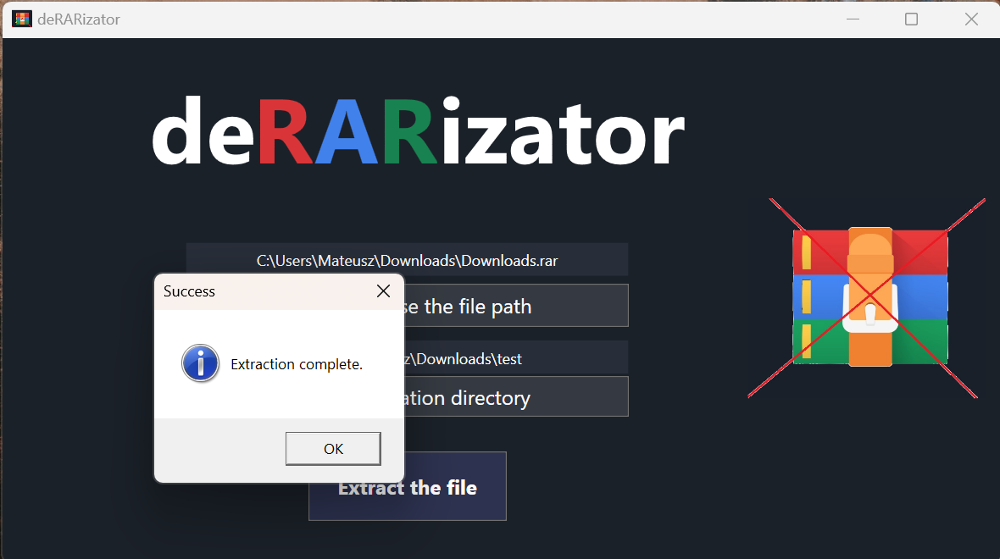

# "deRARizator" is an application written for Windows to export files from RAR archives. If you do not have a WinRAR licence then this application is an excellent substitute.

## The application allows files to be selected using a button that displays a Windows Explorer window or using drag&drop functionality, where files can be dragged into the programme.

### UI is simple and modern. Minimalism was one of the objectives in the development of the user interface.

### Unfortunately, at this stage in the development of the application, no progress indicator showing the progress of file extraction has been implemented. This will be corrected at a later stage.

<h3>Stack:</h3>
<ul>
 <li>.Net - WPF</li>
 <li><a href="https://www.nuget.org/packages/SharpCompress/0.36.0?_src=template">SharpCompress package</li>
</ul>
